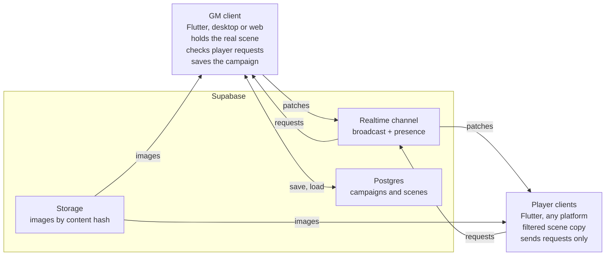
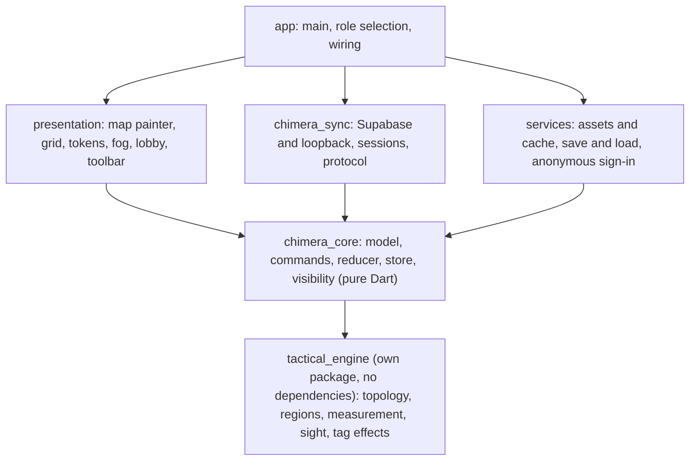
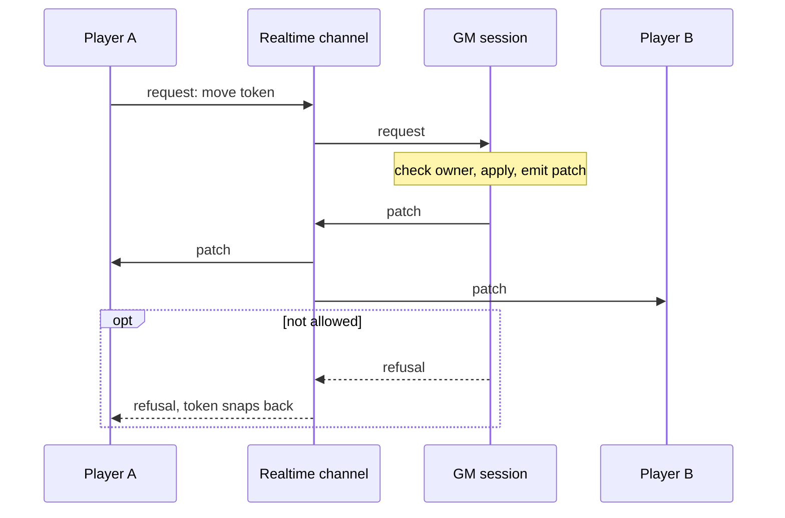
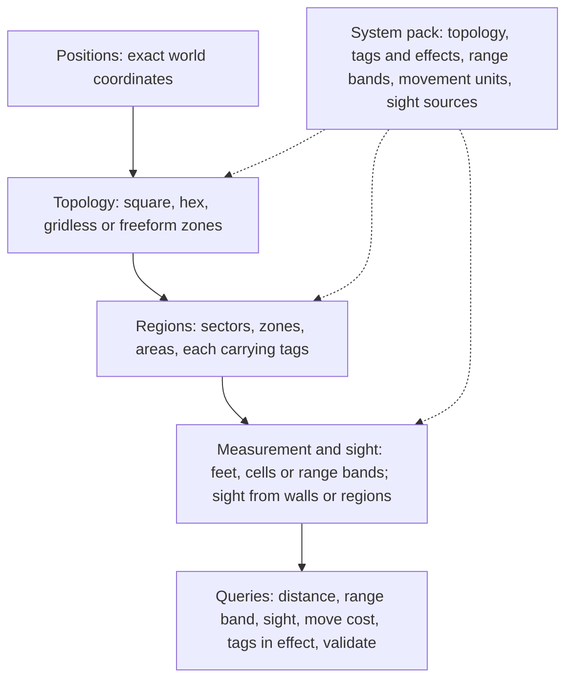

# Chimera VTT — Plan

As of 2026-09-29 · Living copy: [Flutter VTT Plan](https://claude.ai/code/artifact/2f8540db-0ec8-4398-951f-531a85e9181c)

Chimera VTT is one Flutter app for desktop, web and phones, used by GMs and players alike. It combines a tactical map (grid, fog, tokens, conditions, sector tags) with AlchemyRPG-style cinematic scenes. It works with any game system. Tactical play and multiplayer come first, and Solaris Arcanum is the first system pack.

## Contents

1. [Working agreement](#working-agreement)
2. [Background](#background)
3. [Decisions so far](#decisions-so-far)
4. [Why Flutter over Godot](#why-flutter-over-godot)
5. [Architecture](#architecture)
6. [Data model and sync protocol](#data-model-and-sync-protocol)
7. [Campaigns (proposal)](#campaigns-proposal)
8. [Tactical engine](#tactical-engine)
9. [Customization: tiered scripting](#customization-tiered-scripting)
10. [Web constraints](#web-constraints)
11. [Proof of concept](#proof-of-concept)
12. [Roadmap](#roadmap)
13. [Architecture decision records](#architecture-decision-records)
14. [Risks and fallbacks](#risks-and-fallbacks)
15. [Repository review](#repository-review)
16. [Open questions](#open-questions)

---

## Working agreement

AI assistants help with planning, architecture and reviews, and write implementation code too (revised 2026-10-02: the earlier hand-written-only rule is lifted). The [Lexicon](LEXICON.md) governs names in code and docs.

---

## Background

Chimera VTT started with a question about Solaris Arcanum's tag system in Atlas VTT, an Obsidian plugin.

1. **Atlas fork.** Atlas VTT (ByteMirror/atlas-vtt, AGPL-3.0) was forked to `~/Documents/dev/atlas-vtt`, branch `feat/sector-tags`. The fork added sector tags:
   - a `sector` flag on condition definitions
   - a grid-snapped Sector tool (rectangle drawings that carry `conditions` and `conditionValues`)
   - tokens that inherit the tags of the sector their centre is in
   - a hover card instead of permanent labels
   - fog that hides sectors from players
   The 15 Solaris sector tags from Appendix C were prepared for the preset.
2. **The multiplayer limit.** Atlas is local only. It has no networking, and its player view is a second window or a frame capture of the GM's canvas. Adding multiplayer to the fork meant fighting its Obsidian coupling.
3. **A standalone app.** The idea became a new VTT inspired by Atlas and AlchemyRPG. It was planned in Godot first, then moved to Flutter (see below). It also grew from Solaris-only to system-agnostic.

Related prior work: `~/Documents/dev/solaris-tags`, an Owlbear Rodeo extension. In it, each grid cell is a sector and each player switches the sector view on for their own screen. Both ideas carry over.

---

## Decisions so far

| Topic | Decision | Consequence |
| --- | --- | --- |
| Framework | Flutter and Dart. The map is drawn with `CustomPainter`, and Flame is used only if needed | Strong UI and an official Supabase client. Lighting, sight and particles are our own code |
| Platforms | Desktop and web for GM and players, phones later | Campaigns live in Supabase, not local files. Desktop adds export and import |
| Relay | Supabase Realtime | The official `supabase_flutter` client covers Realtime, presence, Auth and Storage. No server of our own |
| Authority | The GM client is the source of truth | Players send requests. The GM checks, applies and broadcasts |
| Priority | Tactical map before cinematic scenes | Cinematic mode is phase 5 |
| Anti-cheat | Trust the table | Hidden tokens and GM pins are never sent. Tokens under fog are sent and only hidden when drawn |
| Scope | System-agnostic | Zone-based and grid-precise play both work. Game rules live in system packs |
| Rules | Separate tactical engine | A pure-Dart package in the monorepo, split out once a second consumer exists |

---

## Why Flutter over Godot

| | Godot 4.7 | Flutter (+ Flame or custom painting) |
| --- | --- | --- |
| Map rendering | Built in: sprites, shaders, 2D lights and shadows, particles | Good for large maps and hundreds of tokens. Lighting, line-of-sight shadows and particles are built by hand or taken from Flame |
| UI (sheets, lobby, journals, settings, forms) | Weaker. Text input on web and phones is clunky | Flutter's core strength |
| Supabase | No official client, so the Realtime protocol would be ours to write | Official `supabase_flutter` |
| Web build | Heavy (estimated 30–40 MB, unverified), WebGL2 renderer only, threads need special headers | A few MB of app plus the rendering runtime |
| Phones | The UI fights you | Native feel |
| Tactical engine | A GDScript addon, usable only inside Godot | A pure Dart package, usable in the app, in tests and in a command-line tool |
| Cinematic mode | Clear winner: particles, animation, audio buses | Doable, with more hand-building |

Verdict: Flutter. The project is mostly UI, rules and networking with a map, not a visual 2D scene with some UI. Godot's advantage is lighting and particles, which only matter from phase 5 on. The third option, TypeScript with PixiJS, was set aside: it's weaker on phones and for heavy UI, and reusing Atlas code would bring the AGPL with it.

---

## Architecture

The GM client holds the real scene. Supabase only relays messages, stores campaigns and serves images.



### Principles

1. **Pure domain core.** `chimera_core` is plain Dart with no Flutter imports, so it runs in fast headless tests.
2. **Every change is a command.** Applying a command returns patches or a refusal. Nothing else changes state, not even the GM's own UI.
3. **One authority per session.** The GM's session runs the reducer. Player sessions only apply the patches they receive.
4. **The transport is behind an interface.** Supabase, loopback (for tests and solo play) and a later self-hosted relay are interchangeable.
5. **Serializable entities.** Every entity converts to and from JSON and carries a schema version.
6. **Presentation observes, never owns.** Views subscribe to the store and send commands. They know nothing about the network.
7. **One codebase, two roles.** GM and player differ only in what they're allowed to do and in the filtered state they receive.
8. **Strict analysis.** Strict Dart analysis options, with lints treated as errors in CI.

### Layers

Dependencies point one way. Every layer may use the core, the core uses only the tactical engine, and the engine uses nothing.



Presentation, sync and services never call each other directly. `app` connects them through the store's change notifications and the session's commands.

### Change flow

A player's drag is a request. The scene changes only when the GM session sends a patch.



Patches carry a sequence number, and a player who sees a gap asks for a fresh snapshot. The GM also sends a heartbeat with its latest sequence number every few seconds, so a missed last batch is noticed too. The dragging player's token moves at once on their own screen, then snaps back if the request is refused or gets no answer within two heartbeats.

### Project layout (planned)

```
chimera_vtt/                # monorepo, a Dart pub workspace
  pubspec.yaml              # workspace root: lists every member, no dependencies
  pubspec.lock              # one lockfile for the whole workspace
  analysis_options.yaml     # shared lint rules
  docs/
  app/                      # the Flutter app
    lib/
      presentation/table/   # map painter, grid, tokens, fog
      presentation/ui/      # lobby, toolbar, sheets
      services/             # assets, persistence, auth
      main.dart             # role selection and wiring
  packages/
    chimera_core/           # pure Dart: model, commands, reducer, store, visibility
    chimera_sync/           # transport interface, Supabase and loopback adapters,
                            # protocol, host and client sessions
                            # (H3 convergence test over a lossy loopback)
    tactical_engine/        # pure Dart, no Flutter, depends on nothing
      lib/src/
        geometry.dart       # Point, Shape (Polygon, Circle)
        topology.dart       # SquareGrid (diagonal rules), Gridless
        pack.dart           # SystemPack, TagDef, Effect building blocks, RangeBand
        engine.dart         # Region, TacticalEngine: measure, tags, sight, moves
      test/                 # every pack's examples, headless
```

Every workspace member declares `resolution: workspace`. `chimera_core` will depend on `tactical_engine` as a workspace dependency once the reducer calls it (phase 4). The engine stays in the monorepo while its API changes often, and moves to its own repository (with `git filter-repo`) once something outside this app uses it. Every package has its own `test/` folder, run with `dart test`, and widgets use `flutter_test`.

---

## Data model and sync protocol

A scene is a set of entities keyed by id, the same shape as Atlas' records, so syncing sends one changed entity at a time. Terms are defined in the [Lexicon](LEXICON.md).

- **Scene:** map image, grid (size, offset, units), and entity tables: tokens, sectors, fog operations, drawings, pins, texts, lights and walls.
- **Token:** position, size, image, owner (a player id), conditions with optional values, hidden flag.
- **Sector:** a region holding sector tags. For Solaris, one grid cell. Each player can switch the sector view on for their own screen.
- **System pack:** a data file defining conditions and sector tags (one definition with a `sector` flag), range bands, trackers and sheet fields.
- **Campaign:** scenes, packs, assets and players, stored in Supabase Postgres, with images in Supabase Storage named by content hash.

The protocol has four kinds of message:

1. `snapshot`: the GM sends the whole player-filtered scene when someone joins or resyncs.
2. `patch`: the GM sends entity upserts and deletes, one per changed entity, with a sequence number.
3. `intent`: a player asks for a change (move token, roll dice, toggle own condition, ping). The GM checks ownership and applies it.
4. `presence`: who is connected, their role and their cursor, from Realtime presence.

A gap in sequence numbers makes a player ask for a fresh snapshot. Patches received from the network are never re-broadcast and never enter undo history.

---

## Campaigns (proposal)

Proposed and built 2026-10-02, decisions below. Today a room holds one scene, autosaved in the GM's browser, and players are anonymous ids. Prep needs more: several scenes ready to switch between, and tokens given to players before they join. Both belong to a campaign, so the campaign comes first and scenes hang off it.

### Who signs in

- **The GM signs in** with an email and a password (Supabase Auth). A campaign has an owner who persists across devices and browsers, so only a signed-in GM can create or open one.
- **Players don't have to.** A player enters with the room code and gives a name and picks a colour. They can be signed in, or anonymous (Supabase's anonymous sign-in, as today). An anonymous player is the same player for as long as that browser keeps its session. If they sign in later, Supabase links the anonymous user to the account and the id stays the same, so nothing they own is lost.

### Shape

- **Campaign:** a name, its owner (the GM), a persistent room code, its scenes and its members.
- **Scene:** what a room holds today, saved under the campaign with a name. The GM picks which scene is live; one at a time.
- **Member:** a player who has entered the campaign's room at least once: their user id, the name and colour they chose. The GM can make a member a token's owner whether or not they're connected. The GM can remove a member, and change the room code so removed members can't come back with the old one.
- **Room:** the live session of a campaign, at the campaign's room code. Players stay in the room when the GM switches scenes.

### Storage

Tables in Postgres, behind row-level security:

| Table | Holds | Who can read and write |
| --- | --- | --- |
| `campaigns` | id, owner, name, room code | The owner |
| `scenes` | id, campaign, name, the scene's JSON, updated | The campaign's owner only |
| `members` | campaign, user id, name, colour | The owner reads and removes; a member reads the members of their campaigns |

- Players never read `scenes`. They get the scene from the GM over Realtime, already filtered, so hidden tokens stay secret.
- A player joins through one function (`join_campaign(code, name, colour)`) that checks the code and adds or updates their member row, rather than by writing `members` directly. A removed member who still has the code can join again, so removing someone for good means changing the code too.
- The GM's autosave writes the live scene's row instead of browser storage. Export and import of scene files stay, for backups and moving scenes between campaigns.
- Images stay in Storage, named by content hash (ADR 006).

### Bricks

All five built 2026-10-02, on the local stack. A hosted project needs `supabase db push` for the campaigns, scenes and members migrations.

1. GM sign-in with email and password.
2. Campaigns: create, list and open them from the lobby; change the room code.
3. Scenes in Postgres: autosave to the live scene, and a scene list to add, rename, switch and delete.
4. Players give a name and pick a colour on entering, and become members. The GM sees and removes members.
5. Token owners chosen from the members, connected or not.

### Decided 2026-10-02

- [x] GM sign-in: email and password.
- [x] The GM can remove a member and change the room code.
- [x] A member's colour: the player picks it.
- [x] Timing: starts now, alongside the remaining POC measurements, not after the go/no-go call (ADR 010 revised).

### Library

Decided 2026-10-02. The GM's account has one library, shared by all their campaigns, so a map or token picture is uploaded once and picked from then on. Map and token entries are images only, not token templates. Scenes go in too, as copies: a library scene is a template that campaigns copy from, so playing a copy never changes it. Built before the remaining POC measurements.

- **Shape:** a `library` table: owner, kind (`map` or `token`), name, the image's asset id, and a small thumbnail's asset id. One row per image and kind for each GM. Owner-only behind row-level security; anonymous users have none.
- **Images** stay in Storage, named by content hash (ADR 006). A thumbnail (256 px) is made in the app at upload, so the library never downloads full maps to show them.
- **Scenes** are a third kind, holding the scene's JSON (map, grid, tokens, fog) instead of an image; their thumbnail is their map's. Copying one into a campaign clears token owners, since owners are one campaign's members.

Bricks:

1. Every upload by the GM (Change map, Change image) also goes into the library.
2. Change map picks from the library's maps, or uploads a new one.
3. A token library on the rail: pick an image to place a token with it, or to change the selected token's image.
4. Rename and delete library entries.
5. Scenes: save a campaign's scene to the library, and start a new scene in any campaign as a copy of a library scene.

---

## Tactical engine

The rules brain is its own Dart package, `packages/tactical_engine`. It is pure Dart: no Flutter, no rendering, no networking, and nothing specific to one game system. It supports zone-based and grid-precise play because every choice about space comes from the system pack.



- **Positions** are always exact. Zone games ignore the precision, and Solaris' Precise Movement option uses it.
- **Topology** divides space: square grid, hex grid, gridless, or freeform zones drawn as polygons.
- **Regions** are sectors, zones and areas (a spell's radius, a smoke cloud). Tags on regions apply to every entity inside.
- **Measurement** returns a value, a unit and, when the pack defines bands, a range band. Sight comes from walls, from regions tagged to block it, or both.
- **Tag effects** use a small set of data building blocks: advantage or disadvantage with a strength, movement cost change, blocks sight, occupant limit, and a required check on entry. Anything the building blocks can't express stays as rules text for people to read.

The engine answers queries and checks commands. The GM session calls it before the reducer applies a command. Player clients call it for previews such as "this move costs 2 AP".

### The same engine, three packs

| Engine part | Solaris Arcanum | D&D 5e | Zone game (Fate-style) |
| --- | --- | --- | --- |
| Topology | Square grid, one cell is one 20 ft sector | Square grid, 5 ft cells | Freeform zones drawn as polygons |
| Measurement | Range bands by sector count: Point Blank (same sector), Adjacent (the 8 around), Medium (up to 10), Far (beyond) | Feet, using the pack's diagonal rule | Zones apart: same zone, adjacent, further |
| Region tags | Sector tags: Heavy Cover, Darkness (X), Zero-g… | Difficult terrain, obscured areas, spell areas | Zone aspects |
| Sight | Regions tagged Line of Sight Breaker | Walls and occluders | Usually none, or zone aspects |
| Movement | 1 AP per sector. Difficult Terrain needs a Traversal check | Feet. Difficult terrain costs double | One zone per move, blocked by barrier aspects |
| Precise mode | Precise Movement: feet inside sectors | Always precise | Not used |

---

## Customization: tiered scripting

Question: should the core embed a small pseudo-code interpreter for maximum customization?

Answer: not a stupid plan. Most serious VTTs have scripting: Foundry runs JavaScript modules, Fantasy Grounds uses Lua, and Roll20 has a sandboxed API. The risk is in how much language you build and where it runs. A full custom language is expensive:

- **It becomes a second product:** a parser, error messages, a debugger, documentation, and versioning.
- **Security:** packs will be shared and their scripts run on the GM's machine, so a script must never reach files, the network or the app.
- **Determinism:** player clients run the same queries for previews, so no local randomness, clocks or hidden state.
- **Runaway scripts:** an infinite loop would freeze the GM's session.

Proposal: three levels, each used only when the one below falls short.

1. **Data building blocks** (ADR 012). They cover most tags.
2. **A small expression language** for formulas and conditions, for example `disadvantage(2) when target.region.has("Obscured")` or `damage = 2d6 + attacker.might`. It reads only what the engine exposes. It has no loops, so it always finishes, and it's deterministic because dice come from the GM's seeded roller. Dart makes a small parser and evaluator straightforward to write and test.
3. **Event hooks that return commands**, such as `on_enter_region`, `on_turn_start` and `on_hit`. A hook never changes state itself. It returns commands that go through the same checks and reducer as a player's click, with a step limit per call.

A full scripting language (for example Lua) would come only if real packs outgrow level 3. It lives in the tactical engine, not in `chimera_core`. It is proposed as ADR 013 and is not yet in the decision log.

---

## Web constraints

The web build sets the limits for everyone, because GM and players both run it. These points are from memory of recent Flutter releases, and phase 0 checks each one.

| Constraint | Effect | Design response |
| --- | --- | --- |
| Web renderers: CanvasKit, or skwasm on browsers with WebAssembly GC | The first load downloads the rendering runtime, a few MB | Loading screen. Measure both renderers in the POC |
| skwasm's multi-threaded mode may need cross-origin isolation headers | Hosting may have to send COOP/COEP headers | Check in phase 0. Fall back to single-threaded if the host can't send them |
| Custom fragment shaders on web | Shader support and first-use stutter need checking | Fog works without shaders (a cut-out blend mode). Shaders are an upgrade |
| Audio starts only after a user gesture | Music can't play automatically | A Join button before anything plays |
| No filesystem access in the browser | The GM can't browse local folders | Uploads go to Supabase Storage. Desktop keeps folder import |

---

## Proof of concept

The POC proves the risky parts of the architecture in one thin slice, and its code becomes the start of the real project.

### Demo script

The POC passes when this session runs start to finish with no restart, once with the GM on desktop and once with the GM in a browser.

1. The GM creates a room and uploads a map image of about 4096 × 4096 px. The app shows a room code.
2. A player opens the web build, enters the code, and sees the map.
3. The GM places two tokens and assigns one to the player.
4. The player drags their token, and the GM sees it glide to where it was dropped. Dragging the GM's token is refused. (Revised 2026-10-02: drags are local and only the drop is sent, for H6; the demo first asked for a live drag.)
5. The GM paints fog over half the map. The player's view goes dark there, and a token moved under the fog disappears for the player.
6. The player closes the tab, reopens it, and is back in the same state.
7. The GM saves the scene, restarts, and loads it again.

Status 2026-10-02:

- **GM in a browser:** all 7 steps pass on the local stack, with the GM and the player in Chrome. In step 4, a player can't pick up a token they don't own (dragging it pans the map), so the refusal is never reached through the interface; it is covered by the sync tests. Step 7 passed through the autosave (a reload). Scenes now save to Postgres, so step 7 is the autosave; testing export and import of scene files was dropped from the POC (2026-10-02).
- **GM on desktop:** not run yet.

### Hypotheses and pass criteria

The thresholds below are first guesses, to be confirmed before the POC starts.

| # | Hypothesis | Test | Pass |
| --- | --- | --- | --- |
| H1 | Flutter's web build draws a large map fast enough for both roles | Time the first load. Count frames with the 4096 px map and 50 tokens | First load ≤ 10 s on a 50 Mbit/s link. 60 fps on an M1-class laptop. (Phones are out of POC scope as of 2026-10-02; the ≥ 30 fps phone check moves to phase 7.) |
| H2 | `supabase_flutter`'s Realtime is fast and reliable enough on desktop and web | Join, broadcast and presence from both builds. Time GM-to-player messages | All three work on both builds. p95 delay ≤ 200 ms within one region |
| H3 | The GM-authoritative model keeps everyone in the same state | Two scripted players send 1,000 random requests | Each player's state hash equals the GM's filtered state hash |
| H4 | Storage can serve images to the web build | Load the map through Storage in the browser, twice | No CORS errors. The cached second load takes ≤ 1 s |
| H5 | Fog works in Flutter's web renderers | Paint and erase fog while players watch | 60 fps while painting. Players see fully opaque fog |
| H6 | A session fits Supabase's message limits | Count messages in a simulated one-hour session, with drags throttled to 15 updates/s | Stays under the current plan's quota, checked against Supabase's pricing page |

### Scope

| In | Out |
| --- | --- |
| Square grid on one map image | Hex grids, lighting, walls |
| Tokens: place, move, assign an owner | Conditions, sector tags, stat blocks |
| Fog: rectangle and brush, paint and erase | Dice, initiative, pings |
| Room code with anonymous sign-in | Accounts, invitations, roles beyond GM and player |
| Snapshot, patch, request and presence messages, and resync | Cinematic scenes, audio |
| Scene saved as a JSON file | Campaigns in Postgres, importers |
| macOS and web builds | Windows and Linux builds, phone layout, UI polish |

### Deliverables and timebox

Two weeks, ending with a go or no-go decision on the architecture.

- A git repository with the domain core, a Supabase transport, a loopback transport for tests, and the demo screens
- Automated tests for the domain core, including the H3 convergence test
- A macOS build and a hosted web build
- A short report with the measured number for each hypothesis
- Decision statuses updated to accepted or rejected

Measured 2026-10-02 (profile builds, GM and player views side by side, 4096 px map, 50 image tokens, 500+ fog strokes, live drag and fog painting): 60 fps with 0% dropped frames on macOS, Chrome skwasm and Chrome CanvasKit, raster p99 ≤ 4.5 ms. Frame rate for H1 and H5 passes; H1's first-load time is not measured yet. CanvasKit turns a picture into an image slowly (about 32 ms), so new fog ops are drawn into the mask in batches (after a 1 s pause or 32 ops) rather than per stroke. Rerun with `flutter run --profile --dart-define=BENCH=true` in `app/`.

H4 measured 2026-10-02 on the local stack: a 9.7 MB, 4096 px JPEG map loads in the web build with no CORS errors, in about 0.25 s on reload (download 110–123 ms, decode 75–112 ms). Storage serves it with `cache-control: max-age=31536000`. The browser upload works, both locally and on the hosted project (Cloudflare-hosted web build, after `supabase db push` created the bucket there). Load times on the hosted project are not measured yet.

H2 measured 2026-10-02 on the hosted project by `make test-live CONFIG=config/prod.json` (`packages/chimera_sync/test/supabase_test.dart`): join, broadcast and presence all work, and 50 GM-to-player moves arrive with a median of 25.6 ms, p95 106.5 ms and max 114.1 ms. Passes (p95 ≤ 200 ms). Measured from one machine running both clients, so it covers the round trip through Supabase but not two players far apart.

H1 first load measured 2026-10-02 on the hosted web build (Cloudflare), in Chrome with the cache off and the link throttled to 50 Mbit/s and 20 ms: 3.1 MB transferred, Flutter's first frame at 715–820 ms over three runs. Passes (≤ 10 s). The first frame is the sign-in screen; the lobby follows after one auth round trip.

H6 estimated 2026-10-02 by `packages/chimera_sync/test/quota_test.dart`, a scripted hour over the loopback: the GM and four players, a heartbeat every 3 s, each player moving their token twice a minute and the GM once, and 100 fog strokes. Supabase bills each broadcast once per client in the room. With drags sent at 15 updates/s it came to about 160,000 messages an hour, about 12 hours a month on the Free plan (2M messages), which fails for a weekly session. Decided the same day: only a drag's drop is sent, and other clients ease the token to its new place (a 300 ms glide). That brings it to 2,328 sends, 11,640 billed messages an hour: about 170 hours a month on Free. Passes; heartbeats are now most of it.

If H2 fails, a small WebSocket relay of our own replaces Realtime behind the same transport interface. If H1 fails, the map moves to a tiled renderer or to Flame before anything else changes.

---

## Roadmap

Phases 1–4 alone make a usable VTT, and cinematic mode and the Solaris pack follow. There are no dates yet: phase 0 measures what the rest will cost.

| # | Phase | Contents | Gate at the end |
| --- | --- | --- | --- |
| 0 | Spike (the POC) | Web build, Realtime, Storage images, the H1–H6 measurements | Browser channel works |
| 1 | GM tabletop | Map, grid, tokens, fog, undo, save | |
| 2 | Players watch | Room code, snapshot, patches, reconnect | Replaces screen sharing |
| 3 | Players act | Own tokens, dice, pings, conditions | |
| 4 | Tactical rules | Conditions, sectors, range bands, initiative, tactical engine | A usable VTT |
| 5 | Cinematic mode | Scenes, parallax, particles, music, ambience, handouts | |
| 6 | Solaris pack | Tags, trackers, threat cards, Atlas and Fantasy Statblocks importers | |
| 7 | Hardening | Request checks, rate limits, private channels with row-level security, hosting, phone layout | |

Phase 1 status 2026-10-03: map, grid, tokens, fog and save came with the POC. Undo was the last piece: the GM's own changes (not players' moves) can be undone and redone, up to 100 steps, with ⌘Z / ⇧⌘Z (Ctrl on other systems) or the rail's buttons, and players see the result like any other change. Loading a scene clears the history. Undo restores whole entities, so undoing a GM edit to a token also reverts a player's move of it made since.

---

## Architecture decision records

| ADR | Decision | Settled by | Status |
| --- | --- | --- | --- |
| 001 | Dart everywhere, strict analysis | Flutter chosen | Accepted |
| 002 | GM-authoritative commands and patches | Plan decision | Accepted |
| 003 | Official `supabase_flutter` client behind the transport interface | H2 | Proposed |
| 004 | Transport interface with a loopback adapter | H3 tests | Proposed |
| 005 | Entities as versioned JSON dictionaries | H3, save and load | Proposed |
| 006 | Images in Storage, named by SHA-256 hash | H4 | Proposed |
| 007 | Fog as ordered operations drawn into a mask layer, as in Atlas | H5 | Proposed |
| 008 | Flutter web renderer (CanvasKit or skwasm) picked by POC measurements | H1 | Proposed |
| 009 | `dart test` for pure-Dart packages, `flutter_test` for widgets | First test run | Proposed |
| 010 | Campaigns in Postgres, with scene files for backup | Phase 1 | Proposed (revised 2026-10-02: started alongside the POC, not after it) |
| 011 | Tactical engine as a separate, system-agnostic pure-Dart package, kept in the monorepo until a second consumer exists | System-agnostic goal | Accepted (revised 2026-09-29: was its own repository) |
| 012 | Tag effects as a small set of data building blocks, with rules text for the rest | First two packs (Solaris, D&D 5e) | Proposed |
| 013 | Tiered customization: data building blocks, then expressions, then hooks that return commands | Phase 4 expression spike | Not yet logged |

---

## Risks and fallbacks

| Risk | Sign it's happening | Fallback |
| --- | --- | --- |
| Large maps stutter in the web build | Under 60 fps with a 4096 px map and 50 tokens on a laptop | Tile the map image, cache token layers as pictures, try Flame's renderer |
| Web build too heavy for phones (phase 7) | First load over 10 s on mid-range phones | Deferred loading, compressed assets, a lighter player layout |
| Free-tier message limits | Token drags exceed the quota in a test session | Throttle drags to about 15 updates/s and send the final position reliably |
| GM closes the tab mid-session | Players lose the host | Players keep the last state, read-only. The GM rejoins and resumes from the saved campaign |
| Scope creep in cinematic mode | Phase 5 grows past its plan | Ship phases 1–4 as a usable VTT first |

---

## Repository review

A review of `~/Documents/dev/chimera_vtt` as created (Flutter 3.47.4, Dart SDK `^3.13.3`, the default counter app), updated as items are resolved.

1. **Git — done.** The repository is initialized, with no commits yet.
2. **Layout — done 2026-09-29.** The app moved into `app/`. The root `pubspec.yaml` is now the workspace root, listing `app`. `app/pubspec.yaml` declares `resolution: workspace`, and `.gitignore` paths were adjusted. `flutter analyze` and `flutter test` pass from `app/`. The core package is `packages/chimera_core/` (folder created, package not yet).
3. **Linting is looser than principle 8.** Only `flutter_lints` is included. Turn on `strict-casts`, `strict-inference` and `strict-raw-types` under `analyzer: language:`, and either add a stricter rule set (for example `very_good_analysis`) or list extra rules yourself. Decide once, at the root.
4. **Platforms.** All six platform folders exist, but the POC needs only macOS and web. Keep the others, or remove them and add them back with `flutter create --platforms=...` later.
5. **Leftovers.** The `pubspec.yaml` description is fixed. `.idea/` and `chimera_vtt.iml` sit at the root, and both are already ignored (`.idea/` and `*.iml`). The IDE project still points at the old root layout, so re-open `app/` or the workspace root in the IDE.
6. **The engine package doesn't exist yet.** `tactical_engine` isn't needed for the POC, only the boundary to it. It will live in `packages/` (ADR 011).

---

## Open questions

- [ ] Engine package name (the app is Chimera VTT)
- [x] App at the repository root or in `app/`: in `app/`, as a monorepo (2026-09-29)
- [ ] How strict the lints are
- [ ] Where the web build is hosted (it may need COOP/COEP headers for skwasm)
- [ ] Import scope: Atlas `.atlasmap` scenes, Fantasy Statblocks notes, or both
- [ ] Hex grids in scope, or square only at first
- [ ] Patch size: whole entities (simple) or only changed fields (smaller drags)? Whole entities for now; revisit if H6 fails.
- [ ] Fog history grows with every stroke: when is it compacted into one mask image for new players?
- [x] Remote drags: only the drop is sent, and other clients glide the token there (2026-10-02, for H6).
- [ ] Access control: is a secret room code enough for the POC, or private channels with row-level security from day one?
- [ ] GM disconnects: do players stay read-only until the GM returns, with no host migration? (Today: yes. Players keep their last state, and their intents expire unanswered.)
- [x] Protocol versioning: refuse mismatched clients (`protocolVersion`, 2026-10-02).
